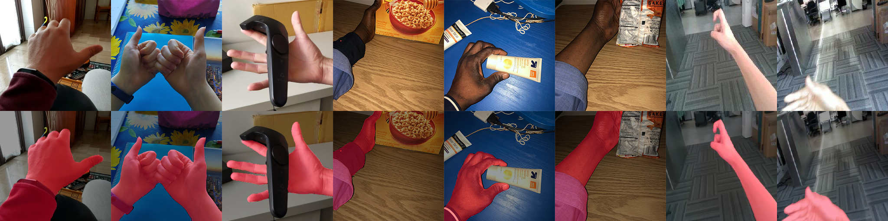

# Upper Limb Segmentation in Egocentric Vision



This repo contains the official test code for the project _Upper Limb Segmentation in Egocentric Vision_.

## Requirements
- python 3.x (versions 3.6 or 3.7 tested)
- numpy
- os
- natsort
- sys
- opencv (version 4.5.1 suggested)
- matplotlib
- tensorflow-gpu 1.15
- CUDA 10.0 
- cuDNN for CUDA 10.0 (such as v7.6.4)

We tested our code on Windows 10 defining a [Miniconda](https://docs.conda.io/en/latest/miniconda.html) environment.

## Test models
Install all dependencies as indicated in the [Requirements Section](#requirements).

The trained models based on the [DeepLabv3+](https://arxiv.org/pdf/1802.02611.pdf) architecture are available in the `deeplab_trained_models` folder.

Run the following command to perform network inference with images from folder. Some sample images are available in the `test_images` folder.
If you want to test your images, change the folder path accordingly in the code.
```
python inference_images_from_folder.py
```

Run the following command to perform network inference using the reading stream from a webcam or a video file
Please, change the video path and cam ID (default is 0) if necessary.
```
python inference_webcam_or_video.py
```


## Dataset

We will release our dataset for encouraging future research on human segmentation. 
Please send an email to monica.gruosso@unibas.it if you need it for academic research and non-commercial purposes.

Before requesting our data, please verify that you understand and agree to comply with the following:
- This data may ONLY be used for non-commercial uses (This also means that it cannot be used to train models for commercial use).
- You may NOT redistribute the dataset. This includes posting it on a website or sending it to others.
- You may include images from our dataset in academic papers.
- Any publications utilizing this dataset have to reference our paper.
- These restrictions include not just the images in their current form but any images created from these images (i.e. “derivative” images).
- Models trained using our data may only be distributed (posted on the internet or given to others) under the condition that the model can only be used for non-commercial uses.

## Citation
If you use the code or the data for your research, please cite the paper:

```
@inproceedings{deeplabv3plus2018,
  title={Encoder-Decoder with Atrous Separable Convolution for Semantic Image Segmentation},
  author={Liang-Chieh Chen and Yukun Zhu and George Papandreou and Florian Schroff and Hartwig Adam},
  booktitle={ECCV},
  year={2018}
}
```

